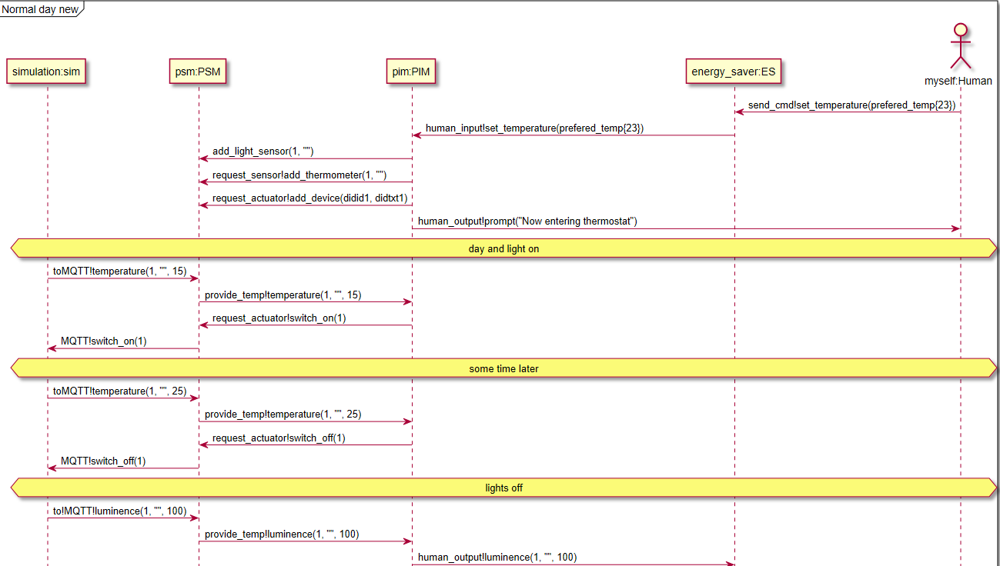

# Overview of mandatory assignement 1 in Models and digital twins

## Architechture diagrams


### Test diagram


## Sequence diagram

### Normal day




```
@startuml sequense diagram
mainframe set name here

participant "simulation:sim" as sim
participant "psm:PSM" as psm
participant "pim:PIM" as pim
participant "enerty_saver:ES" as es
actor "myself:Human" as human

'Set preferred temp
es <- human: set_temperature(prefered_temp{23})
pim <- es: set_temperature(prefered_temp{23})

psm <- es: add_light_sensor(1, "")

psm <- pim: add_thermometer(1, "")
psm <- pim: add_device(didid1, didtxt1)

pim -> human: prompt("Now entering thermostat")

hnote across: day and light on
'setup compleat

sim -> pim: temprature(1, "", 15)
sim -> es: luminence(1, "", 20_000)
sim <- pim: switch_on(1)

hnote across: some time later

sim -> pim: temprature(1, "", 25)
sim -> es: luminence(1, "", 20_000)
sim <- pim: switch_off(1)

hnote across: lights off

sim -> pim: temprature(1, "", 23)
sim -> es: luminence(1, "", 100)

pim <- es: set_temperature(prefered_temp{23} - temp_diff{2})

sim <- pim: switch_off(1)

hnote across: some time later

sim -> pim: temprature(1, "", 20)
sim -> es: luminence(1, "", 100)
sim <- pim: switch_on(1)

hnote across: night start, unchure how to do this...

sim -> pim: temprature(1, "", 20)
sim -> es: luminence(1, "", 100)

pim <- es: set_temperature(prefered_temp{23} - temp_night_diff{8})
sim <- pim: switch_off(1)

hnote across: some time later

sim -> pim: temprature(1, "", 14)
sim -> es: luminence(1, "", 100)

sim <- pim: switch_on(1)

hnote across: day start, unchure how to do this...

sim -> pim: temprature(1, "", 15)
sim -> es: luminence(1, "", 100)

pim <- es: set_temperature(prefered_temp{23} - temp_night_diff{8})
sim <- pim: switch_on(1)

@enduml

```

